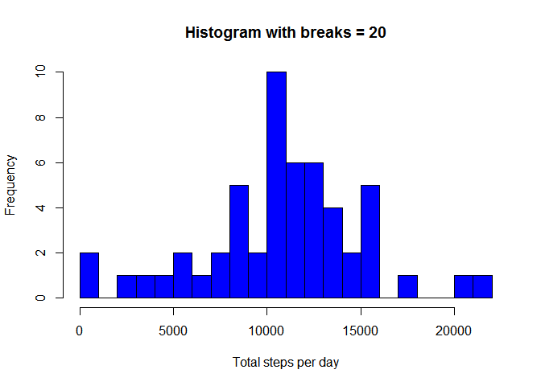
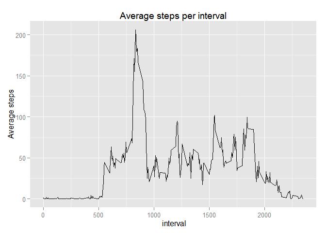
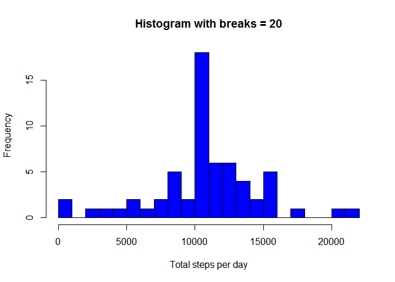
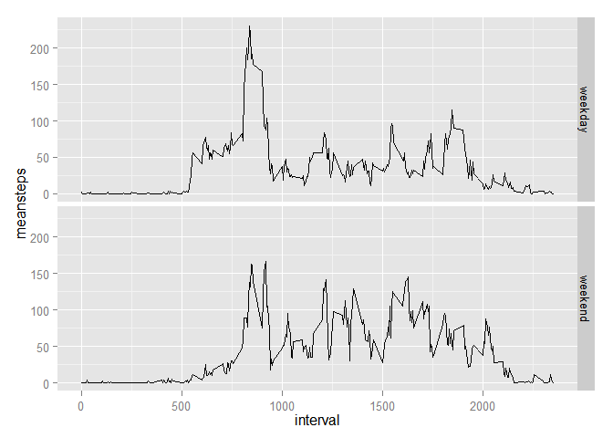

# Reproducible Research: Peer Assessment 1


## Loading and preprocessing the data

1. I will use dplyr for data manipulation and ggplot2 for plotting.
2. Variable date in activity data frme need to be changed to Date object. 
3. Then I created a second data frame without NA value.

```r
library("dplyr")
```

```
## 
## Attaching package: 'dplyr'
## 
## Następujące obiekty zostały zakryte from 'package:stats':
## 
##     filter, lag
## 
## Następujące obiekty zostały zakryte from 'package:base':
## 
##     intersect, setdiff, setequal, union
```

```r
library("ggplot2")
```

```r
activity <- read.csv("activity/activity.csv", header = TRUE, sep=",")
activity$date <- as.Date(activity$date) # change date variable to Date class
activity_no_rm <- activity[complete.cases(activity),] # Create data set without NA
options(digits=2)
options(scipen=999) # removing exponential printing numbers
```

## What is mean total number of steps taken per day?

First, using dplyr's group_by I want to group activity per day and then summarise using function sum all steps per each day.

```r
activity_per_day <- group_by(activity_no_rm, date)
steps_per_day <- summarise(activity_per_day,sumsteps = sum(steps))
```
Next we can plot a histogram...

```r
hist(steps_per_day$sumsteps
     , main = "Histogram with breaks = 20"
     , xlab = "Total steps per day"
     , col = "blue"
     , breaks = 20)
```

 
  
... and calculate the mean and median of total number of steps taken per day.

```r
activity_no_rm.mean <- mean(steps_per_day$sumsteps)
activity_no_rm.median <- median(steps_per_day$sumsteps)
```
The mean of total number of steps taken per day is 10766.19 and the median is 10765

## What is the average daily activity pattern?

To make such time series plot we need to group data frame with interval variable and summarise mean of steps per interval.  
Next I will plot a time series using ggplot2


```r
intervals_group <- group_by(activity_no_rm, interval)
steps_mean_per_interval <- summarise(intervals_group, meansteps=mean(steps))

g <- ggplot(steps_mean_per_interval
            , aes(x = interval, y = meansteps))
g + geom_line() +
        labs(y = "Average steps") +
        labs(x = " interval") +
        labs(title = "Average steps per interval")
```

 

Finding which 5 minute interval contains a maximum number of steps

```r
max_interval<-steps_mean_per_interval[which(steps_mean_per_interval$meansteps==max(steps_mean_per_interval$meansteps)),]
```

```r
interval.interval <-max_interval$interval
meanaveragesteps <- max_interval$meansteps
```

Interval 835 has a maximum average steps of 206.17.

## Imputing missing values

This time I need to use original activity data frame for count NA value in any variable.

```r
colSums(is.na(activity))
```

```
##    steps     date interval 
##     2304        0        0
```
There're 2304 missing values only in steps variable

My startegy is very simple: change NA value with the mean number of steps for the interval, across all days


```r
# impute values are from steps_mean_per_interval
impute <- steps_mean_per_interval
# using dplyr's left_join I will create a new data frame activityNEW with combined activity and steps_mean_per_interval,
# then creating index of NA in activeNEW data frame 
activityNEW <- left_join(activity, steps_mean_per_interval)
```

```
## Joining by: "interval"
```

```r
indexNA <- is.na(activityNEW$steps)

# Next I changed any NA with mean number of steps for the same interval
activityNEW$steps[indexNA]=activityNEW$meansteps[indexNA]

# only checking if there'are missing values
summary(activityNEW)
```

```
##      steps          date               interval      meansteps  
##  Min.   :  0   Min.   :2012-10-01   Min.   :   0   Min.   :  0  
##  1st Qu.:  0   1st Qu.:2012-10-16   1st Qu.: 589   1st Qu.:  2  
##  Median :  0   Median :2012-10-31   Median :1178   Median : 34  
##  Mean   : 37   Mean   :2012-10-31   Mean   :1178   Mean   : 37  
##  3rd Qu.: 27   3rd Qu.:2012-11-15   3rd Qu.:1766   3rd Qu.: 53  
##  Max.   :806   Max.   :2012-11-30   Max.   :2355   Max.   :206
```

It seems that there's no NA value and all NA is filled with counted mean of steps per interval.

```r
activity_per_day_new <- group_by(activityNEW, date)
steps_per_day_new <- summarise(activity_per_day_new,sumsteps = sum(steps))
```
Next we can plot a histogram...

```r
hist(steps_per_day_new$sumsteps
     , main = "Histogram with breaks = 20"
     , xlab = "Total steps per day"
     , col = "blue"
     , breaks = 20)
```

 
  
... and calculate the mean and median of total number of steps taken per day

```r
activity_NEW.mean <- mean(steps_per_day_new$sumsteps)
activity_NEW.median <- median(steps_per_day_new$sumsteps)
```
The mean of total number of steps taken per day is 10766.19 and the median is 10766.19.  
Comparing to previously counted data without NA which mean of total number of steps taken per day was 10766.19 and the median was 10765 we see that:  
1. The meanas have the same value  
2. The medians are different. For data with imputed NA the median is a little bit bigger.

## Are there differences in activity patterns between weekdays and weekends?


```r
# For English weekdays
Sys.setlocale("LC_TIME", "English")
```

```
## [1] "English_United States.1252"
```
Next I create a factor variable with value "weekend" for "Saturday" and "Sunday" and "weekday" for anything else


```r
activityNEW$DayOrWeekend <- as.factor( 
               ifelse(
                       (weekdays(activityNEW$date)
                       %in% c("Saturday","Sunday"))
               ,"weekend","weekday"
               )
)

# just checking if factor variable was creating
table(activityNEW$DayOrWeekend)
```

```
## 
## weekday weekend 
##   12960    4608
```


```r
# First I group activityNEW by interval and DayOrWeekend factor 
# for summarise meansteps of interval for all weekday and weekend

intervals_DW_group <- group_by(activityNEW, interval, DayOrWeekend)
steps_mean_per_intervalDW <- summarise(intervals_DW_group, meansteps=mean(steps))

# Plot the graph 
ggplot(steps_mean_per_intervalDW, aes(x = interval, y= meansteps)) + geom_line() +facet_grid(DayOrWeekend ~.)
```

 


## End
